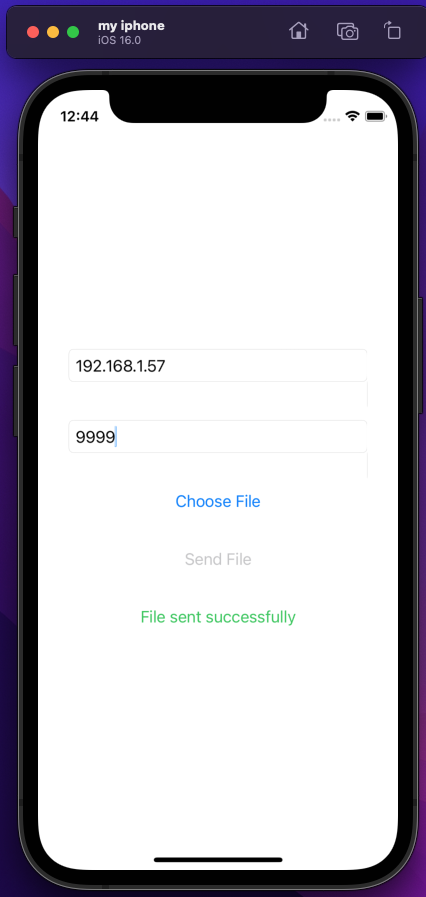

# poulette

Just a small iOS app to send a file over TCP to an IP:PORT.

The app basically does `nc $IP $PORT < $FILE`. 

# preview

# use case

Jailbreaking a ps4 is a 3 stage process.

1. pwn the browser via a webkit exploit
2. kernel exploit with a USB key via [pOOBs4](https://github.com/ChendoChap/pOOBs4)
3. send the [goldhen](https://github.com/GoldHEN/GoldHEN) homebrew via TCP to the ps4 on port 9020

Since the ps4 jailbreak isn't persistent, you have to jailbreak it each time it boots.

And I don't want to power up my laptop each time I wanna play so this app just allows to do step 3 seamlessly.

# TODO

- finish https://stackoverflow.com/questions/4952820/test-ios-app-on-device-without-apple-developer-program-or-jailbreak setup
- autoselect file goldhen if present
- find a way to have a custom numberPad with a dot character for the IP field
- handle IP
